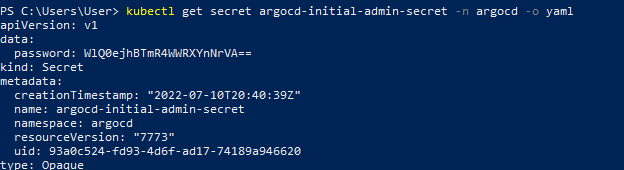
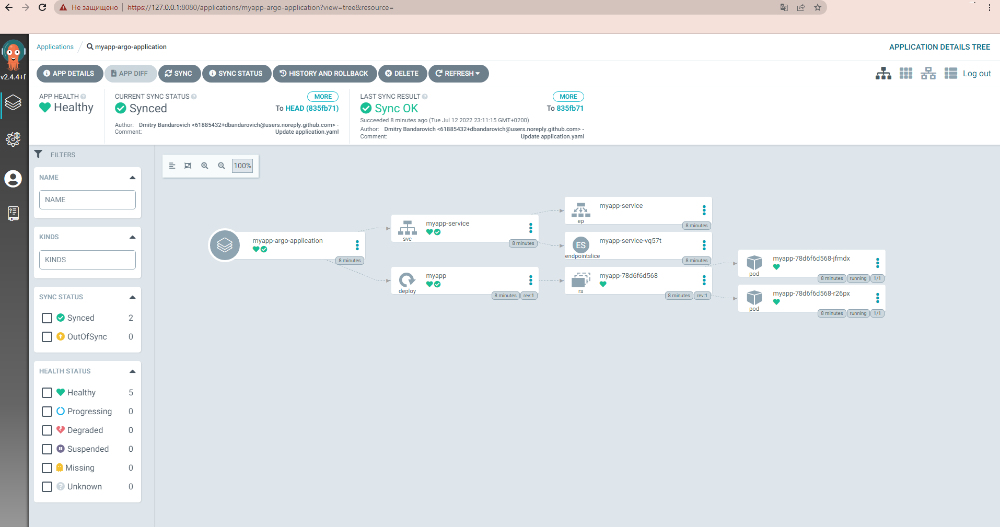
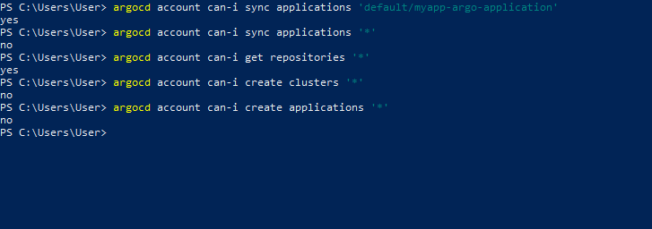
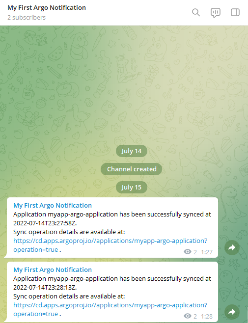

Установить ArgoCD в namespace argocd

Сделать fork какого нибудь helm chart к себе в гит

Добавить этот helm chart в приложения, настроить автодеплоймент при изменениях в репозитории

Добавить пользователя deploy и дать ему права только на это приложение и только на его синхронизацию

Создать телеграмм канал и бота, настроить в него нотификации от ArgoCD

# Установка ArgoCD

1. Устанавливаем приложение
    ```bash
    kubectl create namespace argocd
    kubectl apply -n argocd -f https://raw.githubusercontent.com/argoproj/argo-cd/stable/manifests/install.yaml
    ```
2. Проверка модулей
    ```bash
    kubectl get pod -n argocd
    ```
    argocd-notifications-controller-67cd9d4f7b-chpnq    1/1     Running             0          79s
    argocd-redis-896595fb7-dvbll                        1/1     Running             0          90s
    argocd-applicationset-controller-7575895645-sdg5b   1/1     Running             0          91s
    argocd-server-795bd7c7b4-m8xhl                      1/1     Running             0          92s
    argocd-application-controller-0                     1/1     Running             0          91s
    argocd-application-controller-0                     1/1     Running             0          101s
    argocd-dex-server-5ffdf544bd-fcc8p                  1/1     Running             0          109s
    
3. Пробрасываем порт 8080 для открытия доступа
    ```bash
    kubectl port-forward svc/argocd-server -n argocd 8080:443
    ```
        
4. Устанавливаем CLI-клиент и выполняем вход
    ```bash
    $version = (Invoke-RestMethod https://api.github.com/repos/argoproj/argo-cd/releases/latest).tag_name
    $url = "https://github.com/argoproj/argo-cd/releases/download/" + $version + "/argocd-windows-amd64.exe"
    $output = "argocd.exe"
    
    Invoke-WebRequest -Uri $url -OutFile $output
    ```
    Получаем пароль администратора и декодируем
    ```bash
    kubectl get secret argocd-initial-admin-secret -n argocd -o yaml
    ```
    <p align="left">
    <a href="https://github.com/dbandarovich/ArgoCD/blob/main/images/secret.png">
      
    </a>
    <p align="left">   
    
    Декодируем пароль
    ```bash
    [Text.Encoding]::Utf8.GetString([Convert]::FromBase64String('WlQ0ejhBTmR4WWRXYnNrVA=='))
    ```
    Настраиваем файл в переменной среде PATH.
    Выполняем вход
    ```bash
    argocd login localhost:8080
    ```    
    <p align="left">
    <a href="https://github.com/dbandarovich/ArgoCD/blob/main/images/sync_app.png">
      
    </a>
    <p align="left">   


# Добавление пользователя deploy и настройка прав доступа
1. Применяем манфесты и устанавливаем пароль для нового пользователя
    ```bash
    kubectl apply -f new_user.yaml
    argocd account update-password --account deploy
    kubectl apply -f user_permission.yaml
    ```
    <p align="left">
    <a href="https://github.com/dbandarovich/ArgoCD/blob/main/images/permissions.PNG">
      
    </a>
    <p align="left">

# Уведомления в Telegram
1. Устанавливаем ArgoCD Notifications
    ```bash
    kubectl apply -n argocd -f https://raw.githubusercontent.com/argoproj-labs/argocd-notifications/v1.1.0/manifests/install.yaml
    kubectl apply -n argocd -f https://raw.githubusercontent.com/argoproj-labs/argocd-notifications/v1.1.0/catalog/install.yaml
    ```

2. Создаем бота и новый канал в Telegram, назначаем бота администратором этого канала.

3. Прописываем токен нашего бота в файле secret.yaml, применяем настройки.
    ```bash
    kubectl apply -f .\secret.yaml
    ```
4. Добавляем ссылку на токен бота в ConfigMap argocd-notifications-cm
    ```bash
    kubectl apply -f notification_conf.yaml
    ```
5. Прописываем юзернейм телеграм-канала в файле application.yaml, применяяем настройки.
    ```bash
    kubectl apply -f .\secret.yaml
    ```
6. Проверяем результат
    <p align="left">
    <a href="https://github.com/dbandarovich/ArgoCD/blob/main/images/notification_telegram.PNG">
      
    </a>
    <p align="left">
